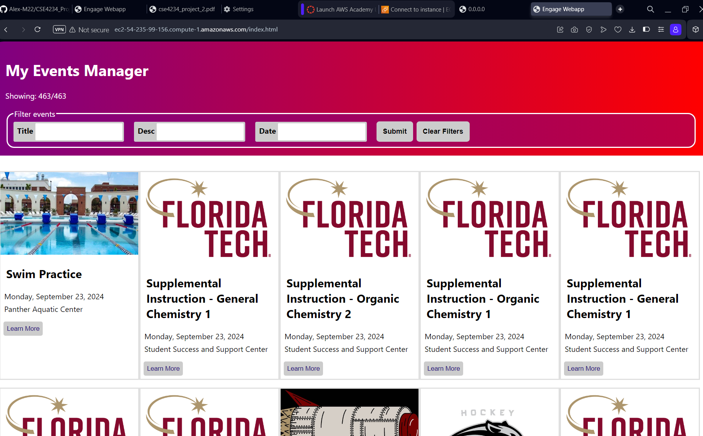
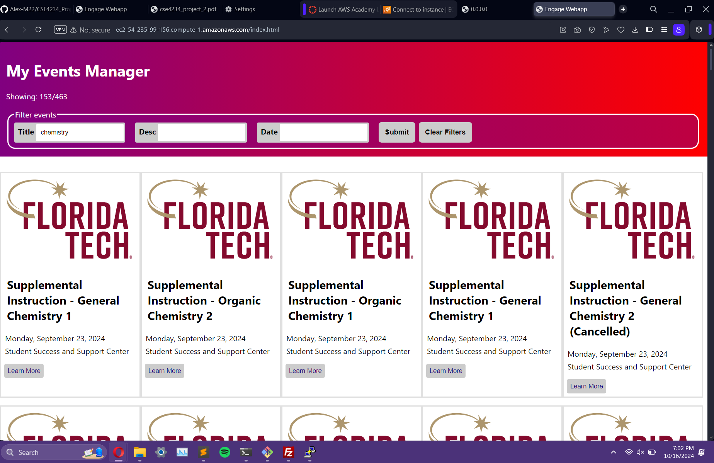
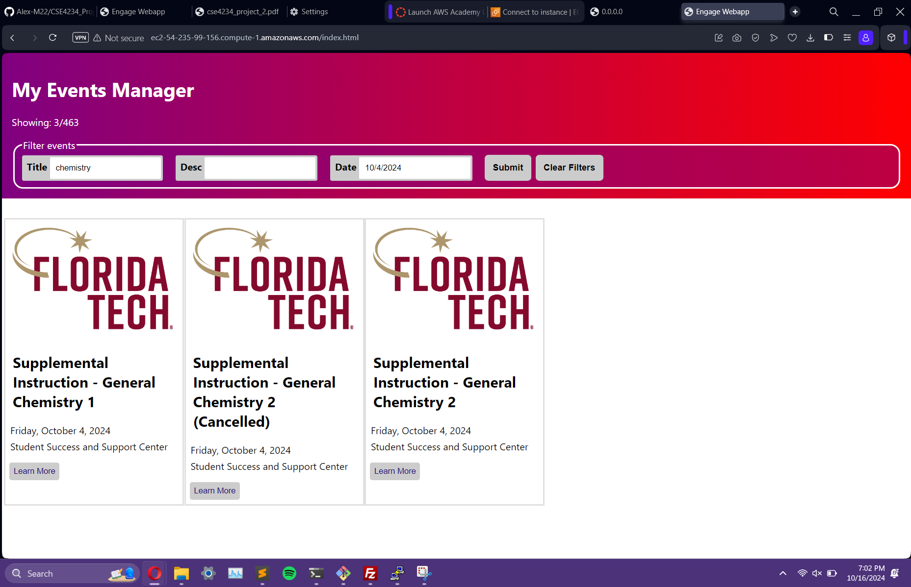
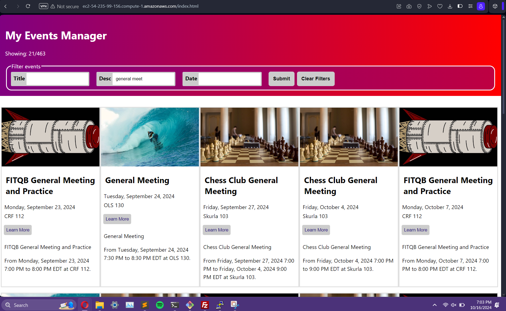
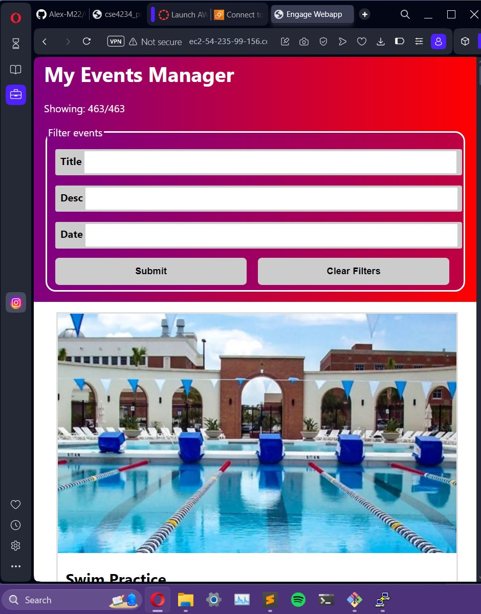
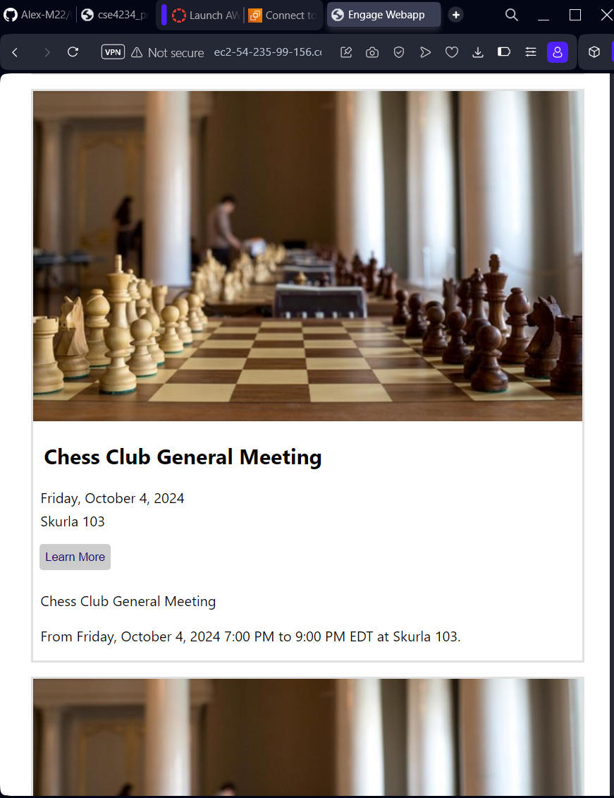

# Webapps Project 2

## Due Oct 19

### Final Push (Alex)

Readme.html is added with photos of the web app running on the ec2 server. 

All photos **are** in the readme.html file, I thought I would just add them here as well.

The page when it is first loaded.

When "Chemistry" is submitted in Title bar

When "chemistry" and "10/4/2024" are submitted

When "general meeting" is submitted into description bar. Learn more is also showing

Mobile View

Mobile view with Learn more
